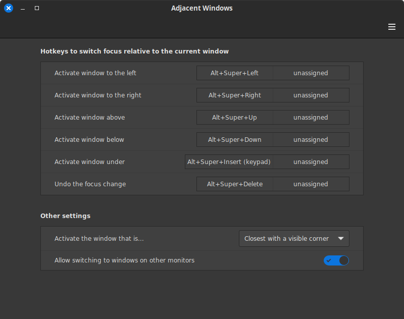

# Adjacent Windows
A Cinnamon extension that allow you to define hot keys which will activate the nearest window to the current window on the left, right, top and bottom.



By default the Super+Alt+(arrow-keys) are defined as the hotkeys to move to adjacent windows, but this can be changed in the config.

## Installation
For the latest development version:
1. Clone the repo (or Download the latest repo by clinking on the green "code" button above then click "Download ZIP")
    ```
    git clone git@github.com:klangman/Adjacent-Windows.git
    ```
2. If you downloaded a ZIP, decompress the zip into a directory of your choice
    ```
    unzip ~/Downloads/Adjacent-Windows-main.zip
    ```
3. Change directory to the cloned repo or the decompressed ZIP file
4. Link the "adjacent-windows@klangman" directory into the "~/.local/share/cinnamon/extensions/adjacent-windows@klangman" directory
    ```
    ln -s $PWD/adjacent-windows@klangman ~/.local/share/cinnamon/extensions/adjacent-windows@klangman
    ```
5. Right click on the cinnamon panel and click "System Settings" then click on "Extensions" under Preferences
6. Select the "Adjacent Windows" entry and then click the "+" button at the bottom of the window
7. Click on the gears icon to the right of the "Adjacent Windows" entry to open the config window so you can change the hotkeys and other options as desired.

## Feedback
Please, if you find any issues or suggestions, feel free to create an issue here on Github. Thanks!


Free Icon: https://www.flaticon.com/free-icon/four-arrows_10696144 Four ways icons created by Laisa Islam Ani
